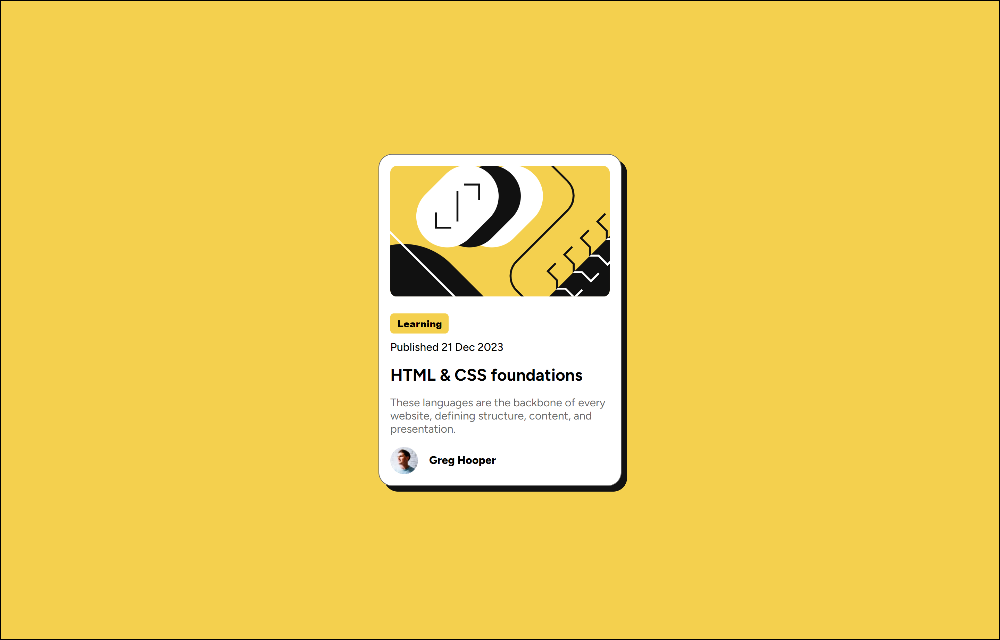
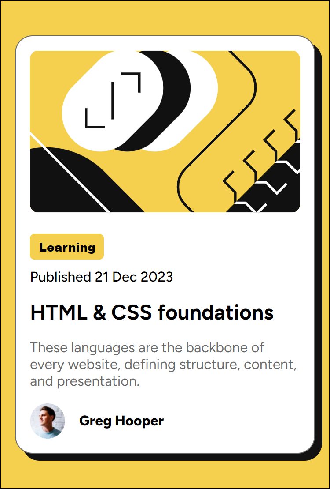

# Frontend Mentor - Blog preview card solution

This is a solution to the [Blog preview card challenge on Frontend Mentor](https://www.frontendmentor.io/challenges/blog-preview-card-ckPaj01IcS).

## Table of contents

- [Overview](#overview)
  - [The challenge](#the-challenge)
  - [Screenshot](#screenshot)
  - [Links](#links)
- [My process](#my-process)
  - [Built with](#built-with)

## Overview

### The challenge

- [Blog preview card challenge](https://www.frontendmentor.io/challenges/blog-preview-card-ckPaj01IcS)

### Screenshot

- Desktop screenshot

- Mobile screenshot

### Links

- Solution URL: [Solution](https://www.frontendmentor.io/solutions/responsive-flex-layout-I3DzYD3WLn)
- Live Site URL: [Live Preview](https://rony-hassan.github.io/frontend-blog/)

## My process

### Built with

- Semantic HTML5 markup
- CSS custom properties
- Flexbox

## Author

- Frontend Mentor - [@rony-hassan](https://www.frontendmentor.io/profile/rony-hassan)
